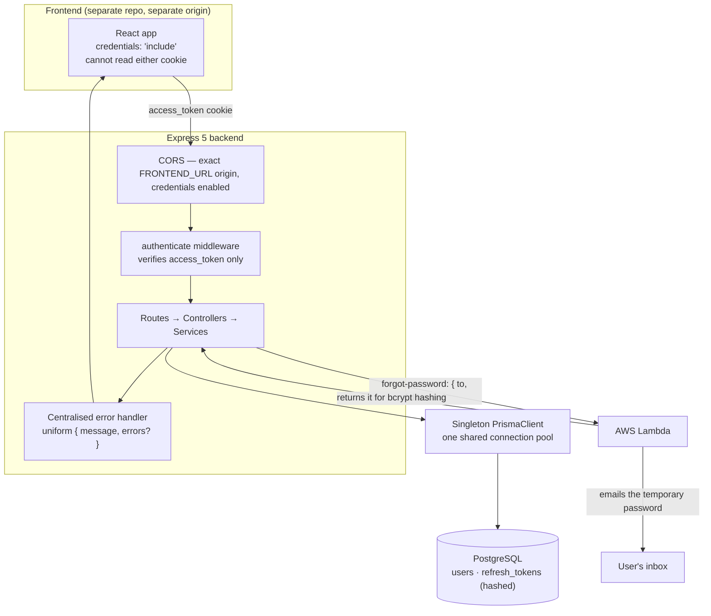
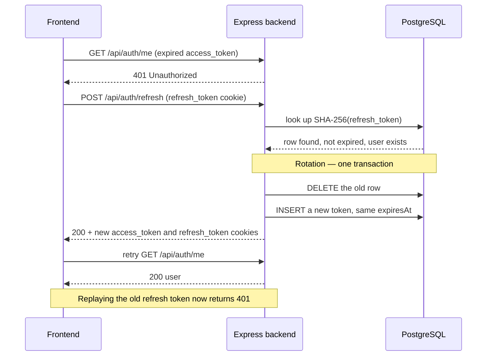

# Solugen Authentication API

Backend for a full-stack authentication system: **Express 5 + TypeScript + Prisma + PostgreSQL**,
using a short-lived **Access Token** alongside a longer-lived, rotating **Refresh Token**, both
delivered as `HttpOnly` cookies.

The frontend lives in a **separate repository** and runs on its own origin. This repo contains no
frontend code and its Compose file defines no frontend container.

---

## Contents

- [Technology choices](#technology-choices)
- [Repository structure](#repository-structure)
- [Installation](#installation)
- [Environment configuration](#environment-configuration)
- [PostgreSQL setup](#postgresql-setup)
- [Prisma migrations](#prisma-migrations)
- [Local development](#local-development)
- [Docker](#docker)
- [Docker Compose](#docker-compose)
- [Architecture](#architecture)
- [Authentication flow](#authentication-flow)
- [Forgot password](#forgot-password)
- [Design pattern: Singleton PrismaClient](#design-pattern-singleton-prismaclient)
- [API reference](#api-reference)
- [OpenAPI and Swagger UI](#openapi-and-swagger-ui)
- [Testing](#testing)
- [Security considerations](#security-considerations)
- [Architectural trade-offs](#architectural-trade-offs)

---

## Technology choices

| Choice | Why |
|---|---|
| **Express 5** | Async handlers that reject are forwarded to the error middleware automatically, so there is no `asyncHandler` wrapper anywhere in the codebase. |
| **TypeScript** (strict, `noUncheckedIndexedAccess`) | Compile-time guarantees around the user and token shapes that cross the API boundary. |
| **Prisma + PostgreSQL** | Typed queries, a readable migration history, and a relational model that fits `User 1→N RefreshToken` naturally. |
| **Zod** | One schema defines validation *and* the inferred request type. Schemas live in `src/schemas/`, never inside controllers. |
| **bcryptjs** | Same algorithm as native `bcrypt`, but pure JavaScript — the Alpine image needs no C++ toolchain, and there is no native module to rebuild per platform. |
| **jsonwebtoken** | Access Tokens only. Refresh Tokens are deliberately *not* JWTs (see [Refresh Token](#refresh-token)). |
| **Jest + supertest** | Integration tests that exercise real HTTP against a real PostgreSQL, rather than mocking the database. |

---

## Repository structure

```
backend/
├── openapi.yaml              # API specification, served at GET /api/docs
├── docker-compose.yml        # db + backend services
├── Dockerfile                # multi-stage production image
├── prisma/
│   ├── schema.prisma         # User and RefreshToken models
│   └── migrations/
├── docker/
│   └── init-test-db.sh       # creates the companion test database
├── src/
│   ├── server.ts             # binds the port, handles graceful shutdown
│   ├── app.ts                # builds the Express app (exported for tests)
│   ├── config/env.ts         # Zod-validated env; all token lifetimes centralised
│   ├── db/prisma.ts          # singleton PrismaClient
│   ├── routes/               # auth, health, docs
│   ├── controllers/          # thin — HTTP in, service call, HTTP out
│   ├── services/             # auth, token, email (Lambda) — the business logic
│   ├── middleware/           # authenticate, validate, error-handler, not-found
│   ├── schemas/              # Zod request schemas
│   ├── types/                # Express Request augmentation
│   └── utils/                # cookies, password, api-error, field-errors
└── tests/                    # mirrors src/ — tests are never co-located with source
```

Requests flow in one direction: **route → validate → (authenticate) → controller → service → Prisma**.
Controllers hold no business logic, and services never touch `req`/`res`.

---

## Installation

Requires **Node.js 22+** and **Docker** (for PostgreSQL).

```bash
npm install
```

Then create a `.env` file (see below), start the database, and apply migrations.

---

## Environment configuration

Configuration comes from a **single `.env` file** in this directory. There is deliberately
**no `.env.example`**, and no `.env.local` / `.env.development` / `.env.production` — create
`.env` yourself with the variables below. It is gitignored and must never be committed.

Required variable **names** (values are yours to supply — none are listed here):

| Variable | Purpose |
|---|---|
| `NODE_ENV` | `development`, `test` or `production`. Controls cookie `Secure`/`SameSite` and the bcrypt cost factor. |
| `PORT` | Port the API listens on. **Use `4000`** — the frontend inlines `http://localhost:4000/api` at build time. |
| `POSTGRES_USER` | Database user, consumed by Docker Compose. |
| `POSTGRES_PASSWORD` | Database password, consumed by Docker Compose. |
| `POSTGRES_DB` | Database name, consumed by Docker Compose. |
| `POSTGRES_PORT` | Host port the database container publishes. |
| `DATABASE_URL` | Prisma connection string. Points at `localhost` for local runs; Compose overrides the host to `db` for the container. |
| `TEST_DATABASE_URL` | Connection string for the Jest suite. Must be a **different database** — the suite truncates tables. |
| `JWT_SECRET` | Signing key for the Access Token. Minimum 32 characters; the app refuses to boot otherwise. |
| `FRONTEND_URL` | The exact allowed CORS origin, e.g. the Vite dev server. |
| `ACCESS_TOKEN_EXPIRATION` | Access Token lifetime, e.g. `15m`. |
| `REFRESH_TOKEN_SHORT_EXPIRATION` | Refresh Token lifetime when Remember Me is **off**, e.g. `1d`. |
| `REFRESH_TOKEN_REMEMBER_ME_EXPIRATION` | Refresh Token lifetime when Remember Me is **on**, e.g. `30d`. |
| `EMAIL_LAMBDA_URL` | Endpoint of the AWS Lambda that emails temporary passwords. Only needed for forgot-password. |
| `EMAIL_LAMBDA_API_KEY` | Sent as `x-api-key` to that Lambda. Optional. |

Durations accept `ms`, `s`, `m`, `h` and `d` suffixes. Every value is validated by Zod at
startup — a missing or malformed variable stops the process with a readable message rather
than failing later at request time.

> **Demonstrating expiry.** Shorten `ACCESS_TOKEN_EXPIRATION` to something like `30s` and
> `REFRESH_TOKEN_SHORT_EXPIRATION` to `2m` to watch expiry, refresh and rotation happen live.

---

## PostgreSQL setup

The database runs in Docker. Nothing needs to be installed on the host:

```bash
docker compose up -d db
```

This starts PostgreSQL with a named volume (`postgres_data`), a healthcheck, and — on first
initialisation only — creates the companion `<POSTGRES_DB>_test` database used by the test
suite, via `docker/init-test-db.sh`.

To reset everything, including data:

```bash
docker compose down -v
```

---

## Prisma migrations

```bash
npm run prisma:migrate     # create and apply a migration in development
npm run prisma:deploy      # apply existing migrations (CI, production, container start)
npm run prisma:generate    # regenerate the client after editing the schema
npm run prisma:studio      # browse the data
```

The schema defines two models:

- **`User`** — `id`, `fullName`, `email` (unique), `passwordHash`, `mustChangePassword`,
  `createdAt`, `updatedAt`
- **`RefreshToken`** — `id`, `tokenHash` (unique), `userId`, `expiresAt`, `createdAt`

`User 1→N RefreshToken` with `onDelete: Cascade`, so deleting a user removes their sessions.
One row per active session means a user can stay signed in on several browsers and devices at
once. `tokenHash` is unique, which both prevents collisions and provides the lookup index;
`userId` and `expiresAt` are indexed as well.

---

## Local development

```bash
docker compose up -d db     # database in Docker
npm run prisma:migrate      # apply migrations
npm run dev                 # API on http://localhost:4000/api
```

| Script | Purpose |
|---|---|
| `npm run dev` | Watch-mode server via `tsx`. |
| `npm run build` | `prisma generate` + `tsc`, emitting to `dist/`. |
| `npm start` | Run the compiled build. |
| `npm run typecheck` | Type-check `src/` **and** `tests/` without emitting. |
| `npm test` | Jest integration suite. |

---

## Docker

The image is multi-stage: a build stage compiles TypeScript and generates the Prisma client,
and the runtime stage installs production dependencies only — the compiler and test tooling
never reach the final image. It runs as the non-root `node` user, and applies pending
migrations before the server starts accepting traffic.

```bash
docker build -t solugen-backend .
docker run --rm -p 4000:4000 --env-file .env solugen-backend
```

Secrets are supplied at run time via `--env-file` / Compose. `.env` is listed in
`.dockerignore` and is never baked into the image.

The Prisma CLI is a **runtime** dependency rather than a dev dependency, because the container
runs `prisma migrate deploy` on start and the CLI must survive `npm ci --omit=dev`.

---

## Docker Compose

Both services read the same single `.env`.

```bash
docker compose up -d db      # database only — run the backend locally
docker compose up --build    # the whole stack in containers
docker compose down -v       # stop and delete the volume
```

The only value that differs between the two modes is the database host: inside the Compose
network PostgreSQL is reachable as `db`, not `localhost`. Compose overrides `DATABASE_URL`
inline for the `backend` service, which is what lets one `.env` serve both without a second
environment file.

> Compose inherits `NODE_ENV` from `.env`, normally `development`, so cookies are not marked
> `Secure` and work over plain HTTP on localhost. A real deployment must set
> `NODE_ENV=production` **and** serve over HTTPS — see [Cookies](#httponly-cookies).

---

## Architecture



Refresh and rotation, which happens when the Access Token has expired:



---

## Authentication flow

### Access Token

A short-lived JWT carrying a **single claim, `userId`** — nothing sensitive, no email, no
role. It is signed with `JWT_SECRET`, stored in the `access_token` cookie at `Path=/`, and its
cookie `Max-Age` is aligned with the JWT's own expiry.

It is the **only** credential that authenticates protected routes. `authenticate` reads it from
the cookie, verifies it, and attaches `userId` to the request.

### Refresh Token

A cryptographically random **256-bit value from `crypto.randomBytes(32)` — not a JWT**. It
carries no claims and grants exactly one privilege: obtaining a new Access Token at
`POST /api/auth/refresh`. It is rejected everywhere else.

Only a **SHA-256 hash** of it is stored in PostgreSQL; the raw value exists solely inside the
`refresh_token` cookie. SHA-256 rather than bcrypt is deliberate: the hash is a *lookup key*,
and bcrypt's per-hash salt would make `findUnique({ tokenHash })` impossible. The slowness
bcrypt exists for protects low-entropy human passwords, and buys nothing against 256 bits of
CSPRNG output.

### Refresh Token rotation

A successful refresh **deletes** the presented token and issues a replacement, in a single
transaction — so a Refresh Token works exactly once, and a replayed one returns `401`. Within
that transaction the delete doubles as the claim on the token, so two concurrent refreshes
using the same cookie cannot both succeed.

The replacement **inherits the original `expiresAt`** rather than restarting the clock. Without
that, a client refreshing on a timer would keep a non-Remember-Me session alive forever and
Remember Me would mean nothing. Sessions therefore end a fixed period after *login*.

### Remember Me

`rememberMe` on login selects between `REFRESH_TOKEN_SHORT_EXPIRATION` and
`REFRESH_TOKEN_REMEMBER_ME_EXPIRATION`. That is its entire effect.

**The Access Token lifetime is identical either way.** Remember Me is never implemented by
issuing a long-lived Access Token — it changes only how long the session can be *renewed*
without re-entering credentials.

### Logout

Logout deletes the hashed Refresh Token row from PostgreSQL **and** clears both cookies. The
token is genuinely dead server-side, not merely forgotten by the browser. Only the session that
logged out ends; other devices stay signed in. It is idempotent and succeeds with no cookies at
all, so an expired Access Token can never trap a user in a signed-in state.

### HttpOnly cookies

Two separate cookies, neither readable by frontend JavaScript, and neither ever present in a
response body:

| Cookie | Path | Contents |
|---|---|---|
| `access_token` | `/` | Short-lived JWT |
| `refresh_token` | `/api/auth` | Opaque random value |

Both are `HttpOnly`. In production both are `Secure` with `SameSite=None`, which is required
for a genuinely cross-origin frontend and only works over HTTPS. In development both use
`SameSite=Lax` without `Secure`, since `localhost:5173` and `localhost:4000` are the same site
— the port is not part of a site — so localhost works over plain HTTP.

**Why `refresh_token` is scoped to `/api/auth`.** Narrowing it keeps the token off ordinary API
requests. It is not narrowed all the way to `/api/auth/refresh` because `POST /api/auth/logout`
must also receive it to delete the matching database row; with the narrower path the browser
would never send it there, and logout could only clear cookies while leaving a working Refresh
Token in the database. `/api/auth` reaches refresh and logout and nothing else.

### CORS

The allowed origin is the exact `FRONTEND_URL` value, with `credentials: true`. A wildcard
origin is not used, and the CORS specification forbids one alongside credentialed requests
anyway. Clients must send `credentials: 'include'`.

---

## Forgot password

Recovery is a two-step flow, and the temporary password never reaches the browser.

1. **`POST /api/auth/forgot-password`** with an email. The backend calls the Lambda, which
   generates the temporary password, emails it to the user, and returns it in its response.
   The backend bcrypt-hashes that exact value into `passwordHash` and sets
   `mustChangePassword = true`.
2. The user copies the password from their inbox and calls **`POST /api/auth/change-password`**
   with `{ email, tempPassword, newPassword }`. The new password must satisfy the registration
   policy and must differ from the temporary one. On success `mustChangePassword` is cleared
   and every session for that user is revoked.

The stored password is replaced **only after the Lambda confirms delivery**. Hashing first and
sending second would lock a user out with a password they never received whenever delivery
failed.

`forgot-password` returns an identical `200` whether or not the address has an account, and
never includes or logs the temporary password.

`change-password` is **public rather than Access Token protected**. A user in recovery has no
valid session by definition, so the temporary password from their email is the credential that
authorises the change. This is a deliberate deviation from a strictly token-protected endpoint.

### Lambda integration

All contact with the Lambda is confined to `src/services/email.service.ts` — controllers never
call it directly. It posts `{ to, fullName }` to `EMAIL_LAMBDA_URL` with an `x-api-key` header
and a 10-second timeout, and expects `{ temporaryPassword }` back.

The backend owns generation's *consequences* (hashing, storage, the `mustChangePassword` flag);
the Lambda owns generating the value and sending the email. Because the contract lives in one
module, adjusting it to match the deployed Lambda means editing a single file.

---

## Design pattern: Singleton PrismaClient

The application creates **one** `PrismaClient` and shares it everywhere, so the whole process
uses a single connection pool. Constructing a client per request, controller, service or route
would open pools without bound and exhaust PostgreSQL's connection limit.

It lives in `src/db/prisma.ts` and every service imports that instance.

Node's module cache already guarantees one instance per process, so there is no Singleton
*class*, no `getInstance()`, and no lazy-initialisation ceremony — that would be complexity for
its own sake. The one addition is a `globalThis` guard, which exists because `tsx watch`
re-evaluates modules on reload and would otherwise leak a new pool on every file save.

```
Express application
   └── singleton PrismaClient
          └── PostgreSQL
```

The pattern is applied here and nowhere else; it is not forced onto unrelated parts of the
codebase.

---

## API reference

Base URL: `http://localhost:4000/api`

| Method | Endpoint | Auth | Description |
|---|---|---|---|
| `POST` | `/auth/register` | — | Create an account; signs the user in. `201` + user. |
| `POST` | `/auth/login` | — | Sign in. `200` + user. Accepts `rememberMe`. |
| `POST` | `/auth/refresh` | `refresh_token` | New Access Token; rotates the Refresh Token. |
| `POST` | `/auth/logout` | `refresh_token` | Ends the session server-side. `204`. |
| `GET` | `/auth/me` | `access_token` | The signed-in user. |
| `POST` | `/auth/forgot-password` | — | Emails a temporary password. Always generic. |
| `POST` | `/auth/change-password` | temp password | Sets a permanent password. |
| `GET` | `/health` | — | Liveness and database readiness. |
| `GET` | `/docs` | — | Swagger UI. |

Register, login, refresh and `/me` all return the **bare user object** — `{ id, fullName,
email, mustChangePassword }` — not wrapped in an envelope.

Every error response has the same shape:

```json
{ "message": "Validation failed.", "errors": { "email": "Please enter a valid email address." } }
```

`errors` is present on validation failures and maps a field name to a message, which the
frontend renders directly beneath the matching input.

---

## OpenAPI and Swagger UI

The specification is `openapi.yaml` at the repository root, and Swagger UI is served at:

```
http://localhost:4000/api/docs
```

It documents every endpoint, request and response schema, error shape and status code, both
cookie security schemes, and the Remember Me, refresh and rotation semantics. "Try it out"
sends credentials, so cookie-authenticated endpoints work from the browser.

A test asserts that the spec documents **exactly** the set of endpoints the router actually
exposes, so the two cannot drift apart silently.

---

## Testing

```bash
npm test
```

95 integration tests run against a real PostgreSQL — the dedicated `TEST_DATABASE_URL`
database, migrated automatically before the run and truncated between tests. The database is
not mocked, so schema, constraints and cascade behaviour are genuinely exercised.

All tests live under `tests/`, mirroring `src/`; they are never co-located with source files.
The bcrypt cost factor drops under `NODE_ENV=test` so hashing does not dominate the runtime.

Coverage includes rotation invalidating a replayed token, concurrent refreshes where only one
wins, Remember Me lifetimes, logout removing the row from the database, cookie paths and
attributes, uniform `401`s across every failure mode, and the forgot-password flow leaving the
old password intact when the Lambda fails.

---

## Security considerations

- Passwords are hashed with bcrypt (cost 12) and never logged, returned, or stored in plain text.
- Refresh Tokens come from a CSPRNG, are stored only as SHA-256 hashes, are validated for
  expiry server-side, are rotated on every use, and are deleted on logout.
- Access Tokens carry only `userId` — no email, no role, nothing sensitive.
- Both cookies are `HttpOnly`, so an XSS payload cannot read them; `Secure` and `SameSite=None`
  in production.
- The Refresh Token cookie is scoped to `/api/auth` instead of `/`.
- A Refresh Token cannot authenticate a protected route; only `/auth/refresh` accepts it.
- Login answers identically for a wrong password and an unknown account, **and** performs a
  throwaway bcrypt comparison when the account does not exist, so response timing does not
  reveal which addresses are registered.
- `forgot-password` returns the same response whether or not the account exists.
- Registration relies on the database unique constraint rather than a pre-flight lookup, so two
  simultaneous signups for one address cannot both succeed.
- Every error passes through one handler that emits `{ message, errors? }` and nothing else —
  no stack traces, Prisma internals, secrets, hashes, tokens or Lambda details.
- CORS names one explicit origin; no wildcard alongside credentials.
- JSON bodies are capped at 10 kB, and the app boots only if `JWT_SECRET` is at least 32
  characters.
- `.env` is gitignored and excluded from the Docker image.

---

## Architectural trade-offs

**Logout cannot revoke an Access Token.** Logout deletes the Refresh Token row and clears both
cookies, so the session is genuinely over — but the Access Token is stateless and stays
cryptographically valid until it expires. Checking a denylist on every request would mean a
database round trip per API call, which is exactly the cost stateless tokens exist to avoid.
The short Access Token lifetime is what bounds this window, and it is why Remember Me is
implemented on the Refresh Token instead.

**Rotation uses absolute, not sliding, expiry.** Inheriting the original `expiresAt` means an
actively used session still ends a fixed period after login. Sliding expiry would be friendlier
but would let a session live indefinitely, making the Remember Me distinction meaningless.

**`forgot-password` still has a timing side channel.** The response body is identical for known
and unknown addresses, but a registered address waits for the Lambda round trip while an
unregistered one returns immediately. Closing it properly means queueing the send or padding
every response to a fixed duration; neither felt proportionate here, but the gap is real.

**No rate limiting.** `login`, `forgot-password` and `change-password` are all brute-forceable
in principle. Production would want per-IP and per-account throttling, which realistically means
a shared store such as Redis — explicitly out of scope for this assignment, so it is named here
rather than quietly omitted.

**`change-password` is public.** The temporary password is the credential. That endpoint is
consequently the most attractive brute-force target in the API, which makes it the first place
rate limiting should land.

**Timestamp columns are not used for session bookkeeping.** `RefreshToken` records no user
agent, IP or last-used time, so there is no "sign out my other devices" screen and no way to
detect a stolen-token replay beyond rotation rejecting it. The schema stays as specified;
adding those columns would be the natural next step.

**bcryptjs over native bcrypt.** Pure JavaScript, so the Alpine image needs no build toolchain
and there is no native module to rebuild per platform. It is measurably slower than the native
binding at the same cost factor — acceptable here, worth revisiting under real login volume.
